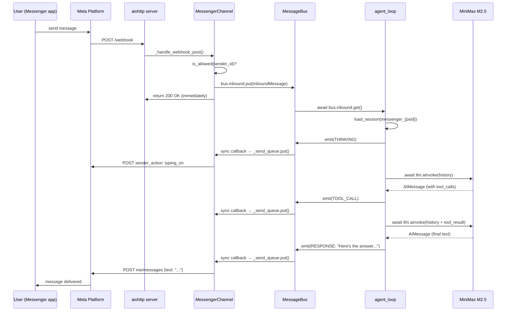

# Facebook Messenger Channel — Design Doc

## Overview

Add Facebook Messenger as the second channel. Same pattern as Telegram: `@register_channel`, sync callback → async send queue, isolated agent per channel.

**Key difference**: Messenger uses webhooks (push) instead of polling (pull), so we need an HTTP server.

## How Messenger Platform Works

```
Meta Platform                          sbot
─────────────                          ────
1. User sends message on Messenger
2. Meta POSTs to our webhook  ──────►  POST /webhook (JSON payload)
3.                                     Parse sender_id + text
4.                                     Push to bus.inbound
5.                                     Agent processes, emits outbound
6.                              ◄────  POST graph.facebook.com/v21.0/me/messages
7. Message appears in user's chat
```

### Webhook Verification (one-time setup)

When you register the webhook URL in Meta Developer Console, Meta sends:
```
GET /webhook?hub.mode=subscribe&hub.verify_token=YOUR_TOKEN&hub.challenge=CHALLENGE_STRING
```
We must echo back `hub.challenge` if `hub.verify_token` matches. This proves we own the endpoint.

### Inbound Message Format

Meta POSTs JSON to `/webhook`:
```json
{
  "object": "page",
  "entry": [{
    "messaging": [{
      "sender": {"id": "USER_PSID"},
      "message": {"text": "hello"}
    }]
  }]
}
```
- `sender.id` = Page-Scoped ID (PSID) — unique per user per page
- Must respond with HTTP 200 within 20 seconds (or Meta retries)

### Outbound (Send API)

```
POST https://graph.facebook.com/v21.0/me/messages
Authorization: Bearer {PAGE_ACCESS_TOKEN}
Content-Type: application/json

{
  "recipient": {"id": "USER_PSID"},
  "message": {"text": "Hello!"}
}
```
- 2000 char limit per message (vs Telegram's 4096)
- Supports typing indicators: `sender_action: "typing_on"`

## Architecture

### Same pattern as Telegram

```
MessengerChannel
├── __init__()      — register with bus, parse config
├── start()         — start aiohttp web server + sender loop
├── stop()          — stop server
├── _on_outbound()  — sync callback → _send_queue.put_nowait()
├── _sender_loop()  — consume queue, POST to Graph API
├── _handle_webhook_get()  — verification challenge
└── _handle_webhook_post() — parse inbound messages → bus.inbound
```

### HTTP Server

Use `aiohttp` for the webhook server. Runs on a configurable port (default 8080).

```python
app = web.Application()
app.router.add_get("/webhook", self._handle_webhook_get)
app.router.add_post("/webhook", self._handle_webhook_post)
runner = web.AppRunner(app)
await runner.setup()
site = web.TCPSite(runner, "0.0.0.0", port)
await site.start()
```

**Why aiohttp**: Already async, lightweight, no extra framework. We only need 2 routes.

### Progress Messages

Same UX as Telegram — edit a single status message in-place for progress, then send final response:
- Messenger supports typing indicators (`typing_on`) — use instead of status messages
- Send `typing_on` on THINKING/TOOL_CALL/TOOL_RESULT
- Send actual text only on RESPONSE/ERROR
- Split messages >2000 chars into chunks

### Env Vars

```
MESSENGER_PAGE_TOKEN=<from Meta Developer Console>
MESSENGER_VERIFY_TOKEN=<any string you choose>
MESSENGER_ALLOWED_IDS=<comma-separated PSIDs, empty=allow all>
MESSENGER_WEBHOOK_PORT=8080
```

## Flow Diagram



## Deployment Note

Messenger webhooks require HTTPS. For local dev:
- Use `ngrok http 8080` to expose localhost with a public HTTPS URL
- Register the ngrok URL in Meta Developer Console

For production: reverse proxy (nginx/caddy) with TLS, or deploy behind a load balancer.

## Dependencies

- `aiohttp` — async HTTP server + client (for Graph API calls)
- No Messenger-specific SDK needed — the API is simple REST

## Risks / Open Questions

1. **20-second timeout**: Meta expects HTTP 200 within 20s. Our handler returns immediately (pushes to bus), so this should be fine.
2. **Message ordering**: Meta may send messages out of order if user sends rapidly. For v1, we process sequentially (one bus per channel).
3. **Rate limits**: Graph API has rate limits (~200 calls/hour per user). For a personal assistant, this is plenty.
4. **Shared HTTP server**: If we add more webhook channels later (Slack, WhatsApp), we may want a shared HTTP server. For now, Messenger owns its own server.
