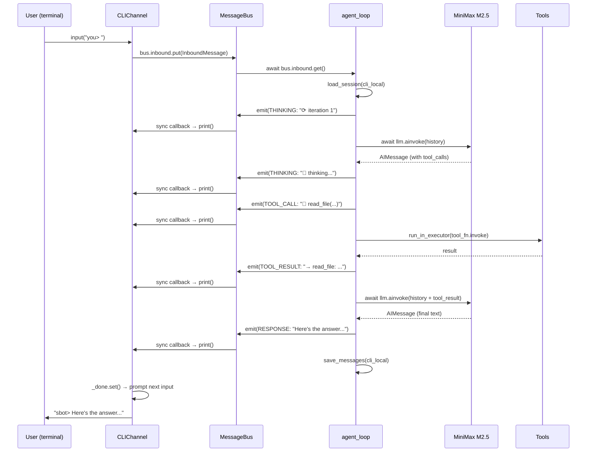
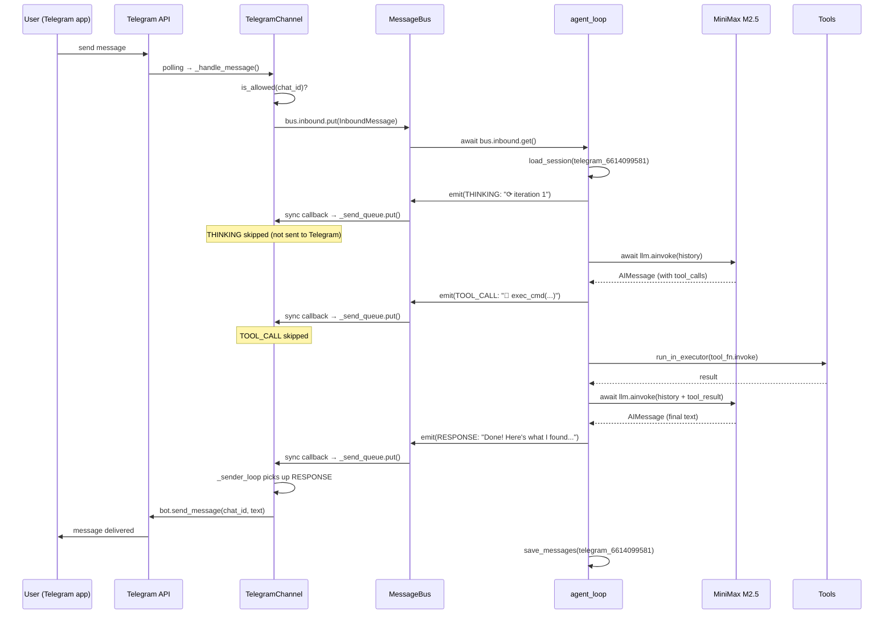
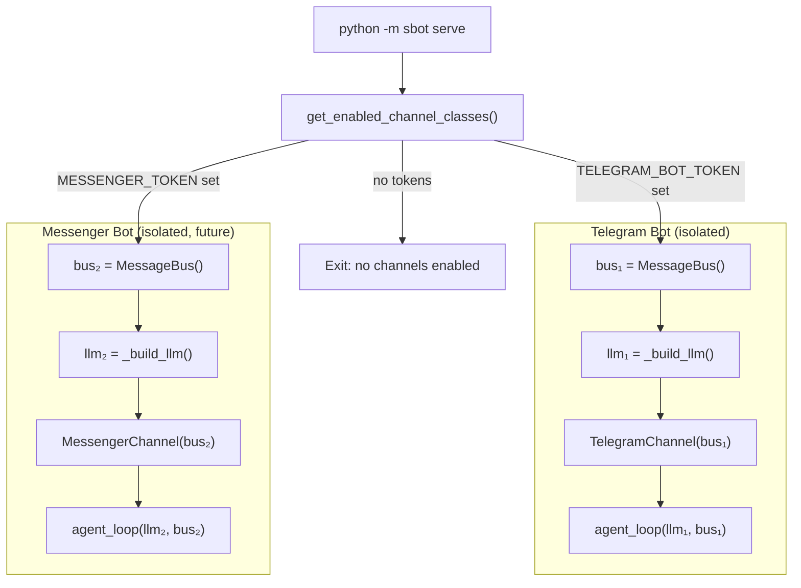

# User Flows — sbot

## CLI Interactive Flow

```mermaid
sequenceDiagram
    participant User as User (terminal)
    participant CLI as CLIChannel
    participant Bus as MessageBus
    participant Agent as agent_loop
    participant LLM as MiniMax M2.5
    participant Tool as Tools

    User->>CLI: input("you> ")
    CLI->>Bus: bus.inbound.put(InboundMessage)
    Bus->>Agent: await bus.inbound.get()
    Agent->>Agent: load_session(cli_local)
    Agent->>Bus: emit(THINKING: "⟳ iteration 1")
    Bus->>CLI: sync callback → print()

    Agent->>LLM: await llm.ainvoke(history)
    LLM-->>Agent: AIMessage (with tool_calls)

    Agent->>Bus: emit(THINKING: "💭 thinking...")
    Bus->>CLI: sync callback → print()

    Agent->>Bus: emit(TOOL_CALL: "🔧 read_file(...)")
    Bus->>CLI: sync callback → print()

    Agent->>Tool: run_in_executor(tool_fn.invoke)
    Tool-->>Agent: result

    Agent->>Bus: emit(TOOL_RESULT: "→ read_file: ...")
    Bus->>CLI: sync callback → print()

    Agent->>LLM: await llm.ainvoke(history + tool_result)
    LLM-->>Agent: AIMessage (final text)

    Agent->>Bus: emit(RESPONSE: "Here's the answer...")
    Bus->>CLI: sync callback → print()
    Agent->>Agent: save_messages(cli_local)
    CLI->>CLI: _done.set() → prompt next input
    CLI->>User: "sbot> Here's the answer..."
```

## Telegram Flow

```mermaid
sequenceDiagram
    participant User as User (Telegram app)
    participant TG_API as Telegram API
    participant TGCh as TelegramChannel
    participant Bus as MessageBus
    participant Agent as agent_loop
    participant LLM as MiniMax M2.5
    participant Tool as Tools

    User->>TG_API: send message
    TG_API->>TGCh: polling → _handle_message()
    TGCh->>TGCh: is_allowed(chat_id)?
    TGCh->>Bus: bus.inbound.put(InboundMessage)
    Bus->>Agent: await bus.inbound.get()
    Agent->>Agent: load_session(telegram_6614099581)

    Agent->>Bus: emit(THINKING: "⟳ iteration 1")
    Bus->>TGCh: sync callback → _send_queue.put()
    Note over TGCh: THINKING skipped (not sent to Telegram)

    Agent->>LLM: await llm.ainvoke(history)
    LLM-->>Agent: AIMessage (with tool_calls)

    Agent->>Bus: emit(TOOL_CALL: "🔧 exec_cmd(...)")
    Bus->>TGCh: sync callback → _send_queue.put()
    Note over TGCh: TOOL_CALL skipped

    Agent->>Tool: run_in_executor(tool_fn.invoke)
    Tool-->>Agent: result

    Agent->>LLM: await llm.ainvoke(history + tool_result)
    LLM-->>Agent: AIMessage (final text)

    Agent->>Bus: emit(RESPONSE: "Done! Here's what I found...")
    Bus->>TGCh: sync callback → _send_queue.put()
    TGCh->>TGCh: _sender_loop picks up RESPONSE
    TGCh->>TG_API: bot.send_message(chat_id, text)
    TG_API->>User: message delivered

    Agent->>Agent: save_messages(telegram_6614099581)
```

## Gateway Startup (multiple isolated bots)

```mermaid
flowchart TD
    START["python -m sbot serve"]
    START --> DISCOVER["get_enabled_channel_classes()"]
    DISCOVER --> |"TELEGRAM_BOT_TOKEN set"| TG_SETUP
    DISCOVER --> |"MESSENGER_TOKEN set"| MSG_SETUP
    DISCOVER --> |"no tokens"| ERROR["Exit: no channels enabled"]

    subgraph "Telegram Bot (isolated)"
        TG_SETUP["bus₁ = MessageBus()"] --> TG_LLM["llm₁ = _build_llm()"]
        TG_LLM --> TG_CH["TelegramChannel(bus₁)"]
        TG_CH --> TG_AGENT["agent_loop(llm₁, bus₁)"]
    end

    subgraph "Messenger Bot (isolated, future)"
        MSG_SETUP["bus₂ = MessageBus()"] --> MSG_LLM["llm₂ = _build_llm()"]
        MSG_LLM --> MSG_CH["MessengerChannel(bus₂)"]
        MSG_CH --> MSG_AGENT["agent_loop(llm₂, bus₂)"]
    end
```
